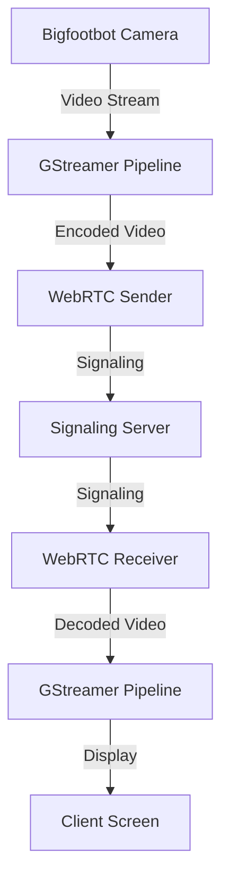
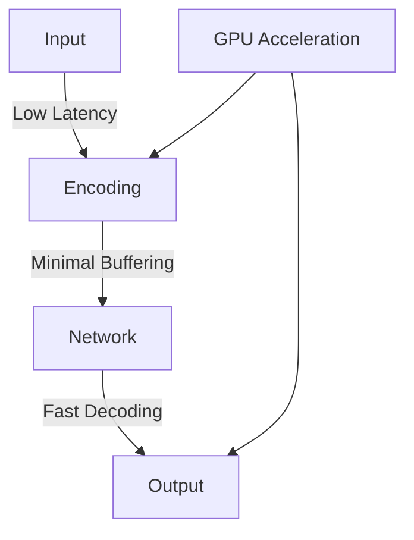
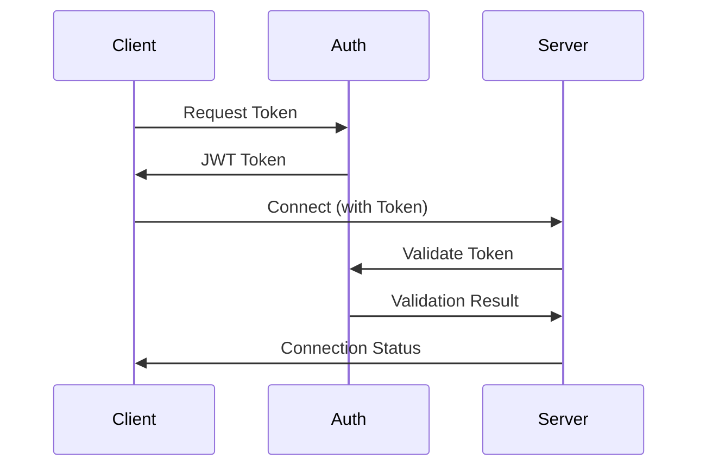
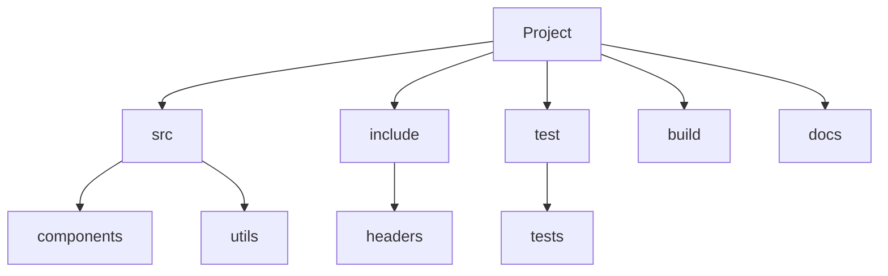

# WebRTC Video Streaming

## Overview

This project implements a WebRTC-based video streaming system for the Bigfootbot robot. It provides real-time video streaming capabilities with low latency and high performance using GStreamer and NVIDIA GPU acceleration.



## Features

- Real-time video streaming
- Low latency using NVIDIA GPU acceleration
- WebRTC-based peer-to-peer communication
- Secure signaling server
- Adaptive bitrate streaming
- Multiple client support
- Cross-platform compatibility

## Prerequisites

### Hardware Requirements
- NVIDIA GPU with CUDA support
- Camera device (USB or network)
- Network interface with sufficient bandwidth

### Software Requirements
- Docker with NVIDIA runtime
- GStreamer 1.0
- WebSocket support
- CUDA toolkit

## Installation

### Docker Installation
```bash
# Build the Docker image
docker build -t bfb_webrtc -f Dockerfile.webrtc .

# Run the container
docker run --gpus all \
    -e NVIDIA_VISIBLE_DEVICES=all \
    -e NVIDIA_DRIVER_CAPABILITIES=all \
    -p 8080:8080 \
    -v /dev/video0:/dev/video0 \
    bfb_webrtc
```

### Manual Installation
```bash
# Install dependencies
sudo apt-get update
sudo apt-get install -y \
    gstreamer1.0-tools \
    gstreamer1.0-plugins-base \
    gstreamer1.0-plugins-good \
    gstreamer1.0-plugins-bad \
    gstreamer1.0-plugins-ugly \
    libgstreamer1.0-dev \
    libgstreamer-plugins-base1.0-dev \
    libnice-dev \
    libwebrtc-audio-processing-dev

# Build components
./build.sh
```

## Usage

### Starting the System
```bash
# Start signaling server
./signaling_server

# Start video sender (on robot)
./video_sender

# Start video receiver (on client)
./video_receiver
```

### Configuration
```yaml
camera:
  device: /dev/video0
  format: NV12
  width: 1280
  height: 720
  fps: 30

webrtc:
  port: 8080
  stun:
    server: stun:stun.l.google.com:19302
  turn:
    server: turn:turn.example.com:3478
    username: user
    password: pass

gstreamer:
  pipeline:
    sender: "v4l2src ! nvv4l2h264enc ! rtph264pay"
    receiver: "rtph264depay ! h264parse ! nvv4l2h264dec ! videoconvert ! autovideosink"
```

## Components

### Video Sender
- Captures video from camera
- Encodes video using NVIDIA GPU
- Establishes WebRTC connection
- Streams video to receiver

### Video Receiver
- Receives video stream
- Decodes video using NVIDIA GPU
- Displays video on screen
- Handles WebRTC connection

### Signaling Server
- Coordinates WebRTC connection
- Manages client connections
- Handles signaling messages
- Provides security

## Performance

### Latency Optimization


### Resource Management
- GPU memory allocation
- CPU usage optimization
- Network bandwidth management
- Buffer size configuration

## Security

### Authentication


### Encryption
- DTLS-SRTP for media
- WSS for signaling
- Certificate-based authentication
- Secure key exchange

## Monitoring

### System Metrics
```bash
# Monitor GPU usage
nvidia-smi --query-gpu=utilization.gpu --format=csv -l 1

# Monitor network traffic
iftop -i eth0

# Monitor CPU usage
top -b -n 1
```

### WebRTC Stats
```javascript
// Get connection statistics
peerConnection.getStats().then(stats => {
    stats.forEach(report => {
        console.log(report);
    });
});
```

## Troubleshooting

### Common Issues
1. Camera not detected
   - Check device permissions
   - Verify v4l2 support
   - Test with v4l2-ctl

2. GPU acceleration issues
   - Verify NVIDIA drivers
   - Check CUDA installation
   - Test with nvidia-smi

3. Network connectivity
   - Check firewall settings
   - Verify port forwarding
   - Test with netcat

### Logging
```bash
# Enable debug logging
export GST_DEBUG=3
export WEBRTC_DEBUG=1

# View logs
tail -f /var/log/webrtc.log
```

## Development

### Code Structure


### Building
```bash
# Configure
cmake -B build

# Build
cmake --build build

# Test
cd build && ctest
```

## Contributing

1. Fork the repository
2. Create a feature branch
3. Commit your changes
4. Push to the branch
5. Create a pull request

## License

This project is licensed under the MIT License - see the [LICENSE](LICENSE) file for details.

## Contact

- Maintainer: [Your Name]
- Email: [Your Email]
- Issue Tracker: [GitHub Issues] 