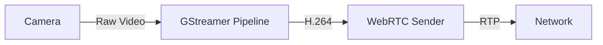

# WebRTC Video Streaming

## Overview

This project implements a WebRTC-based video streaming system for the Bigfootbot robot. It provides real-time video streaming capabilities with low latency using GStreamer and NVIDIA GPU acceleration. The system is available in both Python and C++ implementations.


## Components

### Signaling Server
A simple WebSocket server that handles the WebRTC signaling process:
- Manages client connections
- Forwards SDP offers/answers
- Forwards ICE candidates


### Video Sender
Captures video from a camera and streams it via WebRTC:
- Uses NVIDIA GPU for video encoding
- Implements low-latency streaming



### Video Receiver
Receives and displays the video stream:
- Implements low-latency display
- Uses CPU-based video decoding


## Installation

### Prerequisites
- NVIDIA GPU with CUDA support (for sender)
- GStreamer 1.0
- Python 3.x (for Python version)
- C++ compiler (for C++ version)
- WebSocket support

### Dependencies
```bash
# Install GStreamer
sudo apt-get install -y \
    gstreamer1.0-tools \
    gstreamer1.0-plugins-base \
    gstreamer1.0-plugins-good \
    gstreamer1.0-plugins-bad \
    gstreamer1.0-plugins-ugly \
    libgstreamer1.0-dev \
    libgstreamer-plugins-base1.0-dev \
    libgstreamer-sdp-1.0-dev \
    libgstreamer-webrtc-1.0-dev

# Install Python packages (for Python version)
pip install websockets

# Install C++ dependencies (for C++ version)
sudo apt-get install -y \
    libjsoncpp-dev \
    libx11-dev
```

## Usage

### Python Version
```bash
# Start signaling server
python3 src/signaling.py

# Start video sender (on robot)
python3 src/send.py

# Start video receiver (on client)
python3 src/recv.py
```

### C++ Version
```bash
# Build the C++ components
./build.sh

# Start signaling server
./bin/signaling

# Start video sender (on robot)
./bin/send

# Start video receiver (on client)
./bin/recv
```

### Configuration
The system uses the following default settings:
- Signaling server: ws://0.0.0.0:8765
- Video resolution: 640x480
- Frame rate: 30 fps
- Bitrate: 1 Mbps
- STUN server: stun.l.google.com:19302

## Implementation Details

### GStreamer Pipeline (Sender)
```bash
v4l2src device=/dev/video20 ! video/x-raw,width=640,height=480,framerate=30/1 \
! nvvidconv ! video/x-raw(memory:NVMM),format=I420 \
! nvv4l2h264enc bitrate=1000000 iframeinterval=30 control-rate=1 preset-level=1 profile=2 \
! h264parse ! rtph264pay config-interval=1 pt=96 \
! application/x-rtp,media=video,encoding-name=H264,payload=96
```

### GStreamer Pipeline (Receiver)
```bash
webrtcbin name=recvonly bundle-policy=max-bundle stun-server=stun://stun.l.google.com:19302 \
decodebin ! videoconvert ! xvimagesink
```

## Troubleshooting

### Common Issues
1. Camera not detected
   ```bash
   # Check camera devices
   ls /dev/video*
   v4l2-ctl --list-devices
   ```

2. GPU acceleration issues
   ```bash
   # Check NVIDIA GPU
   nvidia-smi
   ```

3. WebRTC connection issues
   ```bash
   # Check network connectivity
   ping stun.l.google.com
   ```

4. Build issues (C++ version)
   ```bash
   # Check GStreamer installation
   pkg-config --modversion gstreamer-1.0
   
   # Check JSON-CPP installation
   pkg-config --modversion jsoncpp
   ```

## License

This project is licensed under the MIT License - see the [LICENSE](LICENSE) file for details.

## Contact

- Maintainer: Jevgeni Kalbin
- Email: jevgeni.kalbin@gmail.com 