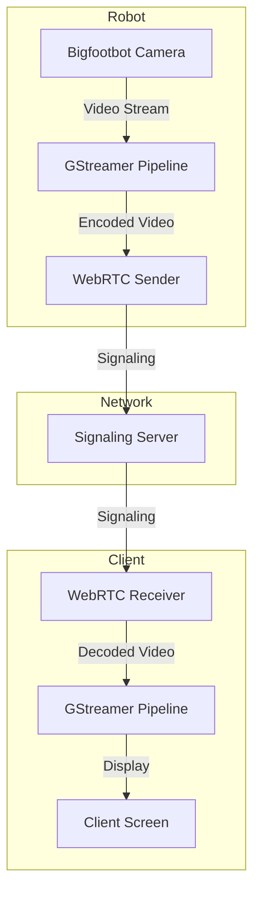
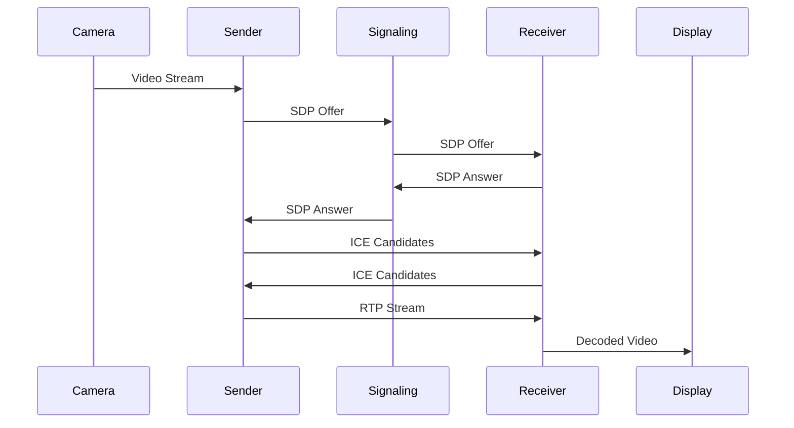
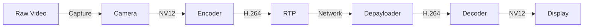
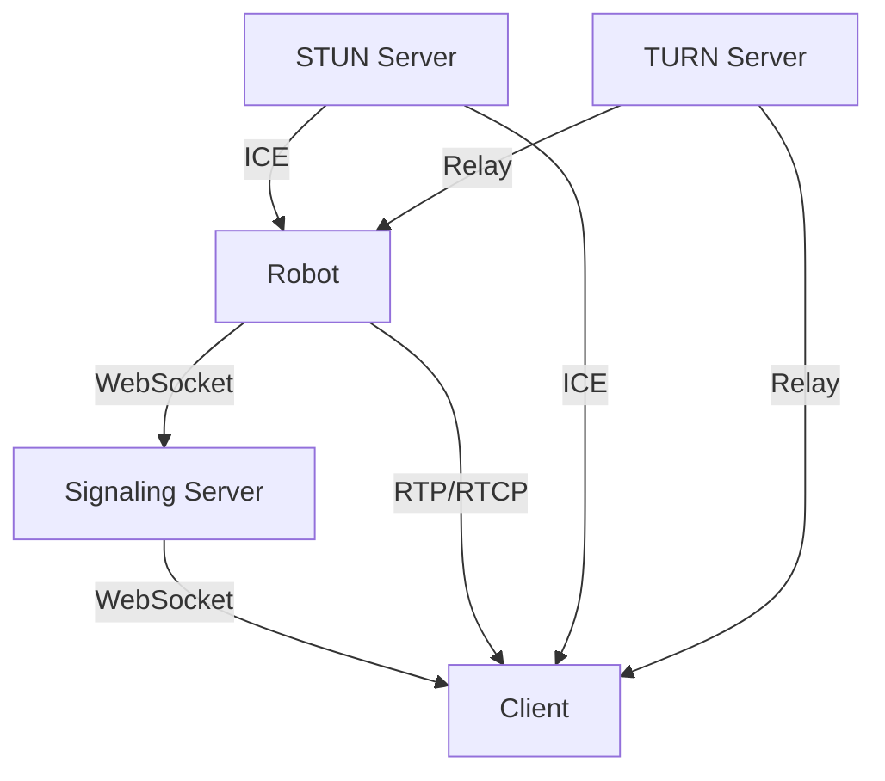
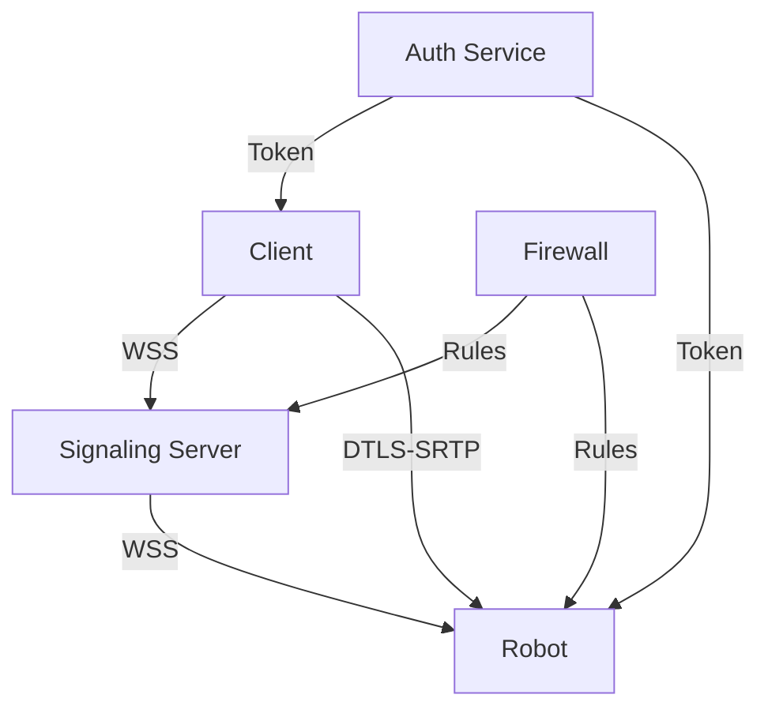
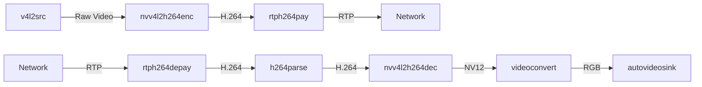
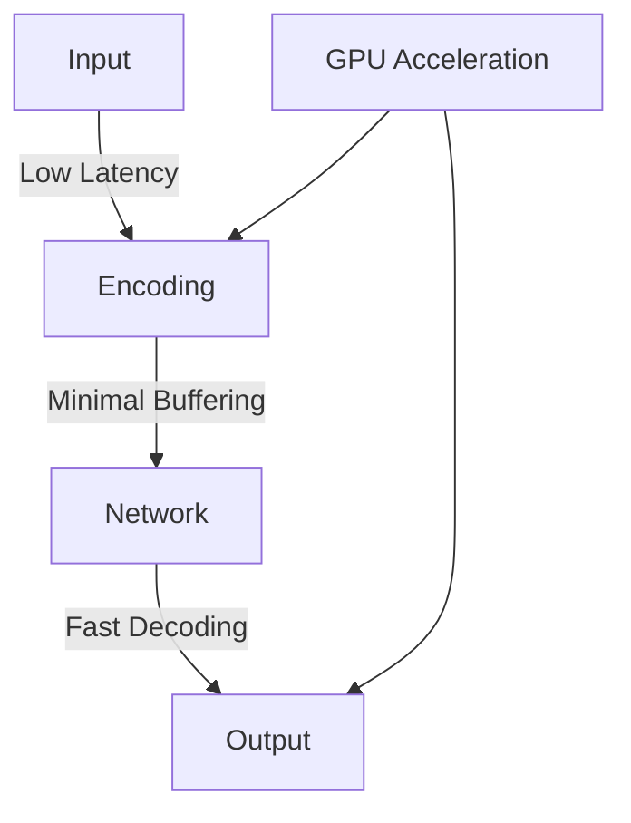
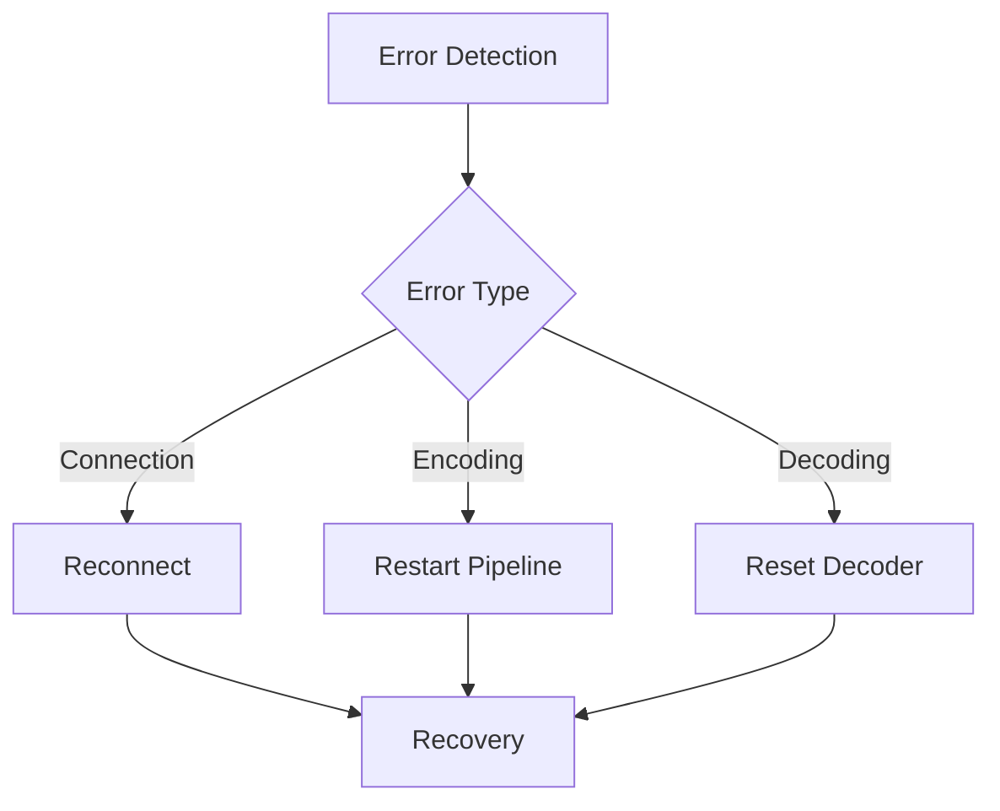
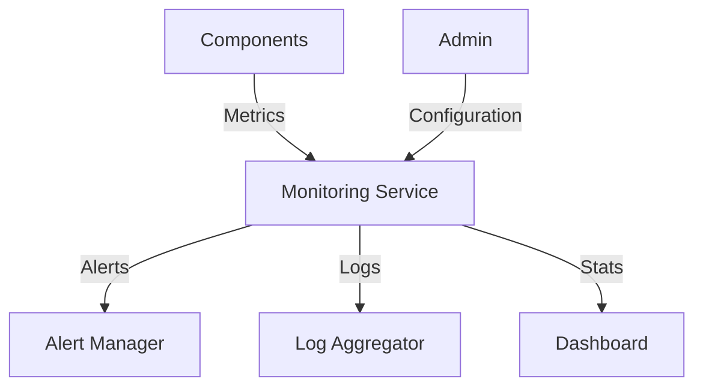
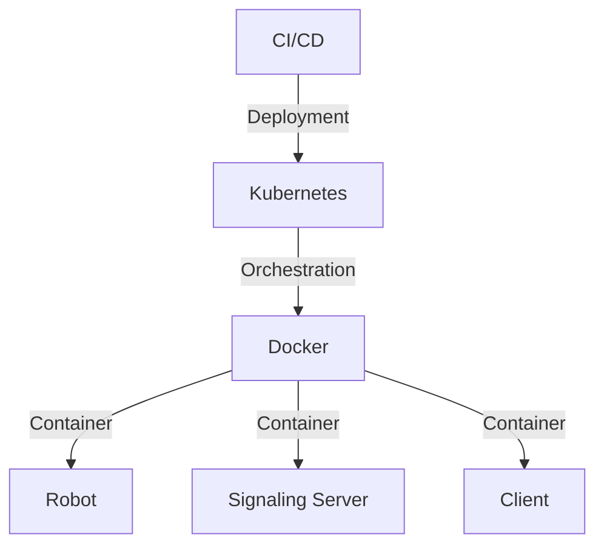

# Architecture Overview

## System Architecture

## Component Interaction

## Data Flow

## Network Architecture

## Security Architecture

## Component Details

### Camera Interface
- V4L2 driver support
- NV12 format output
- Configurable resolution and framerate
- Hardware acceleration support

### GStreamer Pipeline

### WebRTC Components
- Sender: Handles video encoding and streaming
- Receiver: Manages video decoding and display
- Signaling: Coordinates connection establishment
- ICE: Handles network connectivity

## Performance Considerations

### Latency Optimization

### Resource Management
- GPU memory allocation
- CPU usage optimization
- Network bandwidth management
- Buffer size configuration

## Error Handling

## Monitoring Architecture

## Deployment Architecture

## Scaling Considerations

### Horizontal Scaling
- Multiple signaling servers
- Load balancing
- Session distribution
- Resource allocation

### Vertical Scaling
- GPU resource management
- Memory optimization
- CPU core utilization
- Network bandwidth allocation

## Future Architecture

### Planned Improvements
- WebRTC data channel support
- Multiple camera streams
- Adaptive bitrate streaming
- Enhanced security features
- Cloud integration
- Edge computing support 