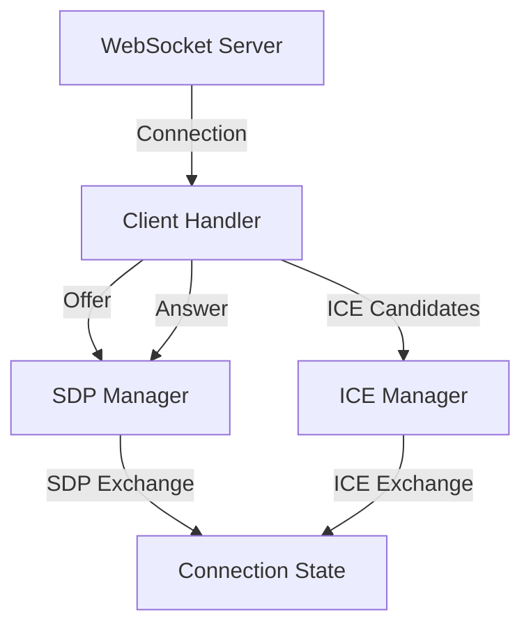
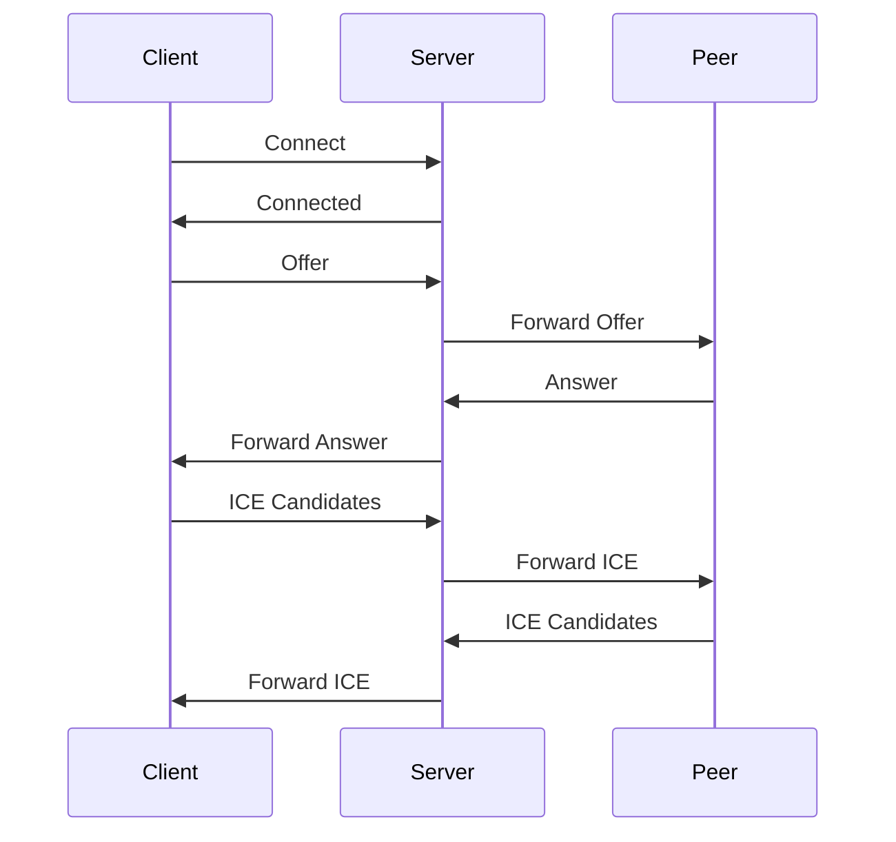
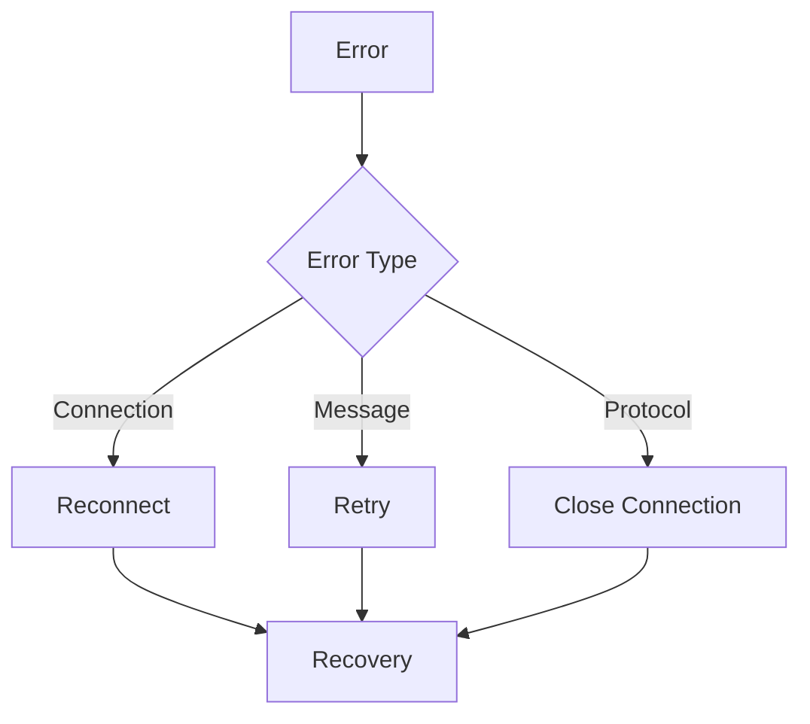

# Signaling Server

## Overview
The signaling server facilitates the WebRTC connection establishment between the video sender (robot) and receiver (client). It uses WebSocket for communication and handles the exchange of SDP offers/answers and ICE candidates.

## Architecture



## Message Flow



## Implementation Details

### C++ Implementation
```cpp
class SignalingServer {
    WebSocketServer ws_server;
    std::map<std::string, ClientHandler> clients;
    
    void handle_offer(const std::string& client_id, const std::string& offer);
    void handle_answer(const std::string& client_id, const std::string& answer);
    void handle_ice_candidate(const std::string& client_id, const std::string& candidate);
};
```

### Python Implementation
```python
class SignalingServer:
    def __init__(self):
        self.ws_server = WebSocketServer()
        self.clients = {}
    
    async def handle_offer(self, client_id: str, offer: str):
        pass
    
    async def handle_answer(self, client_id: str, answer: str):
        pass
    
    async def handle_ice_candidate(self, client_id: str, candidate: str):
        pass
```

## Message Format

### Offer/Answer
```json
{
    "type": "offer|answer",
    "sdp": "SDP content",
    "client_id": "unique_client_id"
}
```

### ICE Candidate
```json
{
    "type": "ice_candidate",
    "candidate": "ICE candidate string",
    "sdpMid": "media stream id",
    "sdpMLineIndex": 0,
    "client_id": "unique_client_id"
}
```

## Error Handling



## Configuration
- Port: 8765 (configurable)
- Max connections: 10 (configurable)
- Timeout: 30 seconds (configurable)

## Security
- WebSocket authentication
- Message validation
- Rate limiting
- Connection monitoring

## Monitoring
- Active connections
- Message throughput
- Error rates
- Connection latency

## Troubleshooting
1. Check WebSocket connection
2. Verify message format
3. Monitor connection state
4. Check error logs
5. Verify client authentication 