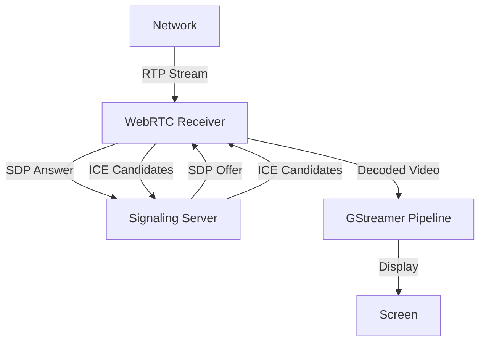
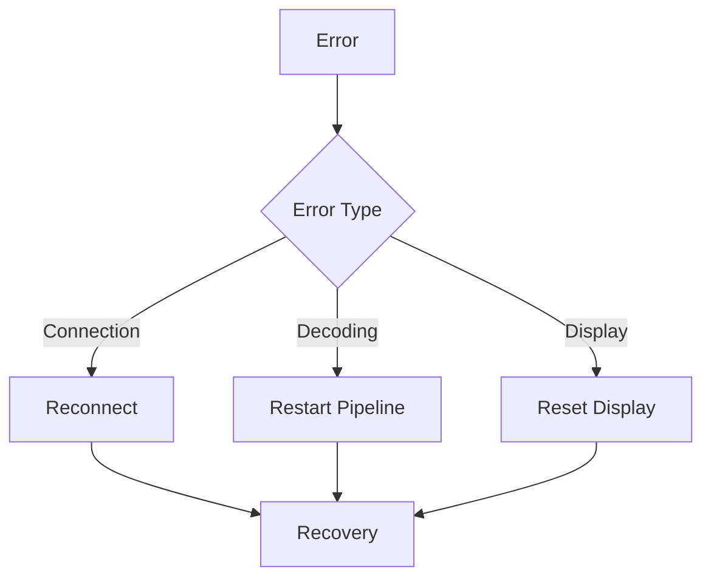

# Video Receiver

## Overview
The video receiver component establishes a WebRTC connection with the sender, receives the video stream, decodes it using GStreamer, and displays it on the client's screen.

## Architecture



## GStreamer Pipeline


## Implementation Details

### C++ Implementation
```cpp
class VideoReceiver {
    GstElement* pipeline;
    GstWebRTCBin* webrtcbin;
    SignalingClient* signaling;
    
    void create_pipeline();
    void setup_webrtc();
    void handle_answer_created(GstPromise* promise);
    void handle_ice_candidate(GstElement* webrtc, guint mline_index, gchar* candidate);
};
```

### Python Implementation
```python
class VideoReceiver:
    def __init__(self):
        self.pipeline = None
        self.webrtcbin = None
        self.signaling = None
    
    def create_pipeline(self):
        pass
    
    def setup_webrtc(self):
        pass
    
    async def handle_answer_created(self, promise):
        pass
    
    async def handle_ice_candidate(self, mline_index, candidate):
        pass
```

## Pipeline Configuration

### RTP Depayloader
```bash
rtph264depay ! h264parse ! nvv4l2h264dec ! videoconvert ! autovideosink
```

### Display Configuration
```json
{
    "display": "autovideosink",
    "window-width": 1280,
    "window-height": 720,
    "fullscreen": false
}
```

## Error Handling



## Performance Optimization
- GPU-accelerated decoding
- Frame dropping on high latency
- Buffer management
- Display synchronization

## Monitoring
- Frame rate
- Decoding latency
- Network jitter
- Display performance
- Error rates

## Troubleshooting
1. Check network connectivity
2. Verify GPU availability
3. Monitor pipeline state
4. Check display configuration
5. Review error logs

## Configuration
- Display settings
- Decoding parameters
- Network settings
- WebRTC configuration
- Window properties 