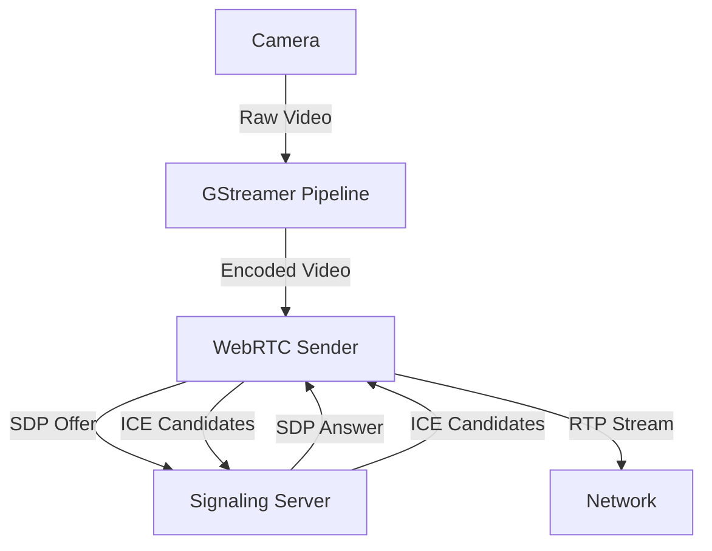
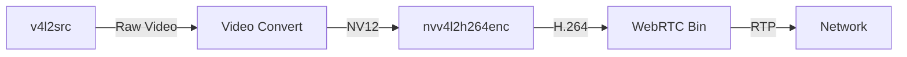
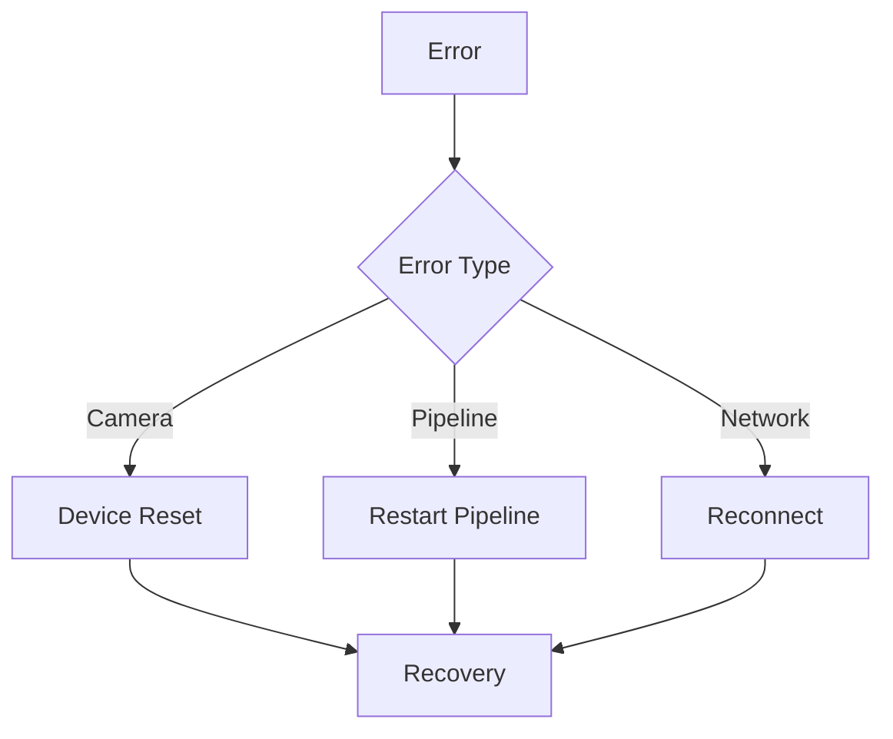

# Video Sender

## Overview
The video sender component captures video from the robot's camera, encodes it using GStreamer, and establishes a WebRTC connection to stream the video to clients.

## Architecture



## GStreamer Pipeline



## Implementation Details

### C++ Implementation
```cpp
class VideoSender {
    GstElement* pipeline;
    GstWebRTCBin* webrtcbin;
    SignalingClient* signaling;
    
    void create_pipeline();
    void setup_webrtc();
    void handle_offer_created(GstPromise* promise);
    void handle_ice_candidate(GstElement* webrtc, guint mline_index, gchar* candidate);
};
```

### Python Implementation
```python
class VideoSender:
    def __init__(self):
        self.pipeline = None
        self.webrtcbin = None
        self.signaling = None
    
    def create_pipeline(self):
        pass
    
    def setup_webrtc(self):
        pass
    
    async def handle_offer_created(self, promise):
        pass
    
    async def handle_ice_candidate(self, mline_index, candidate):
        pass
```

## Pipeline Configuration

### Camera Source
```bash
v4l2src device=/dev/video0 ! video/x-raw,format=NV12,width=1280,height=720,framerate=30/1
```

### Video Encoding
```bash
nvv4l2h264enc bitrate=4000000 ! h264parse ! rtph264pay config-interval=1
```

### WebRTC Configuration
```json
{
    "stun-server": "stun:stun.l.google.com:19302",
    "turn-server": "turn:turn.example.com:3478",
    "turn-username": "user",
    "turn-password": "pass"
}
```

## Error Handling



## Performance Optimization
- GPU-accelerated encoding
- Adaptive bitrate control
- Frame rate adjustment
- Buffer management

## Monitoring
- Frame rate
- Bitrate
- Encoding latency
- Network status
- Error rates

## Troubleshooting
1. Check camera access
2. Verify GPU availability
3. Monitor pipeline state
4. Check network connectivity
5. Review error logs

## Configuration
- Camera device path
- Video format and resolution
- Encoding parameters
- Network settings
- WebRTC configuration 