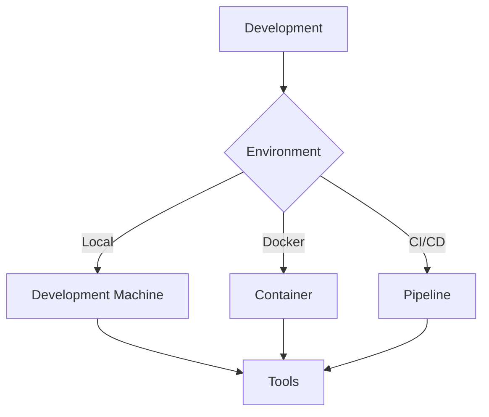
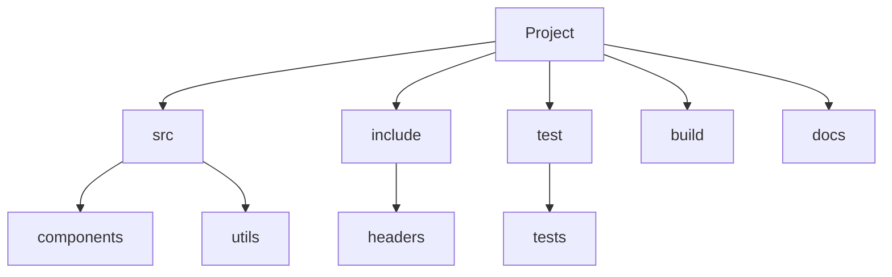
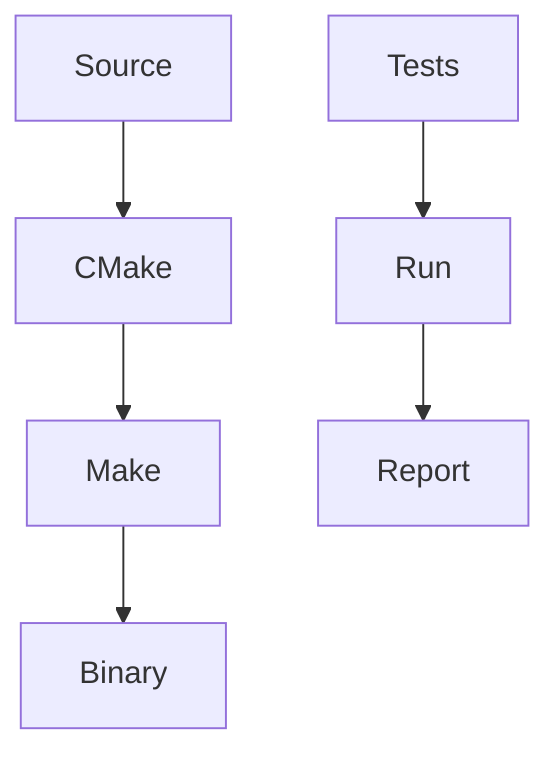
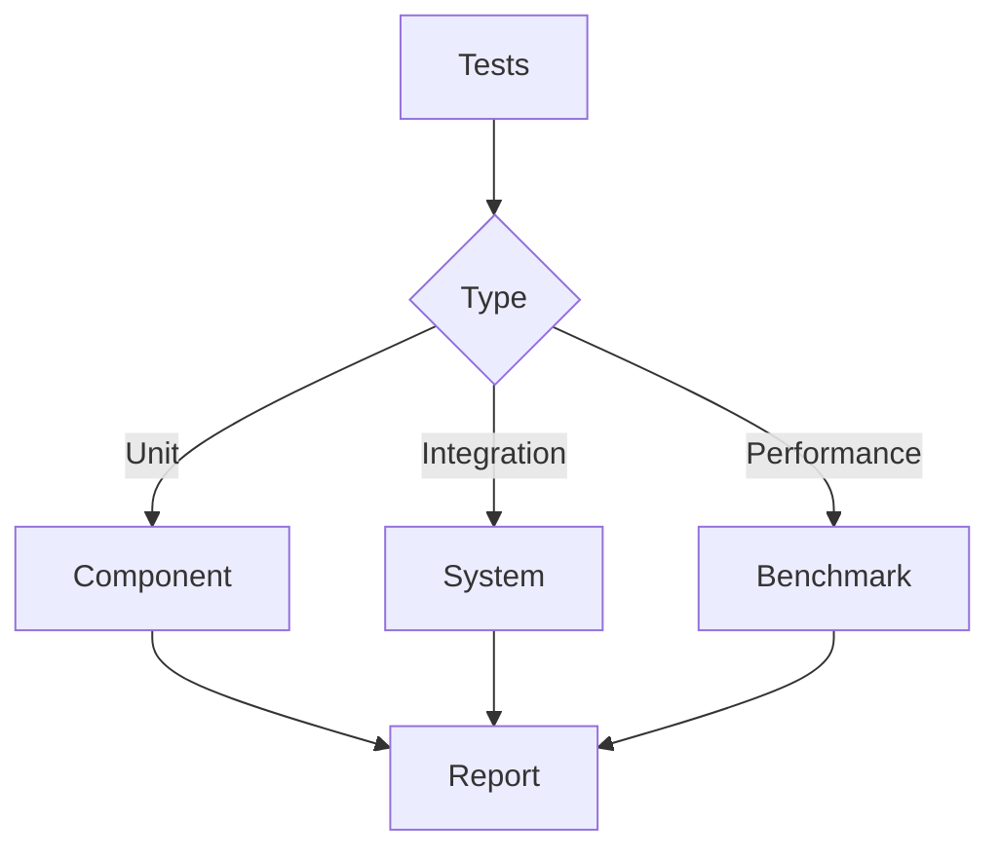
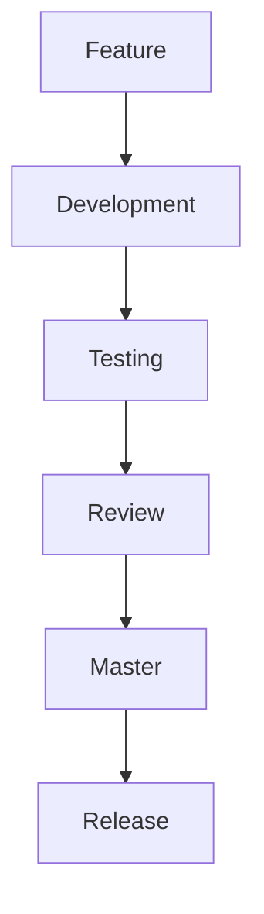
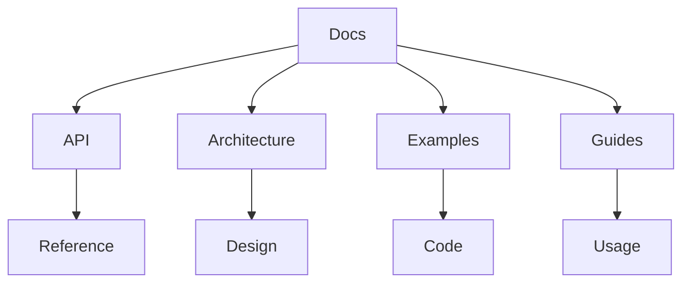
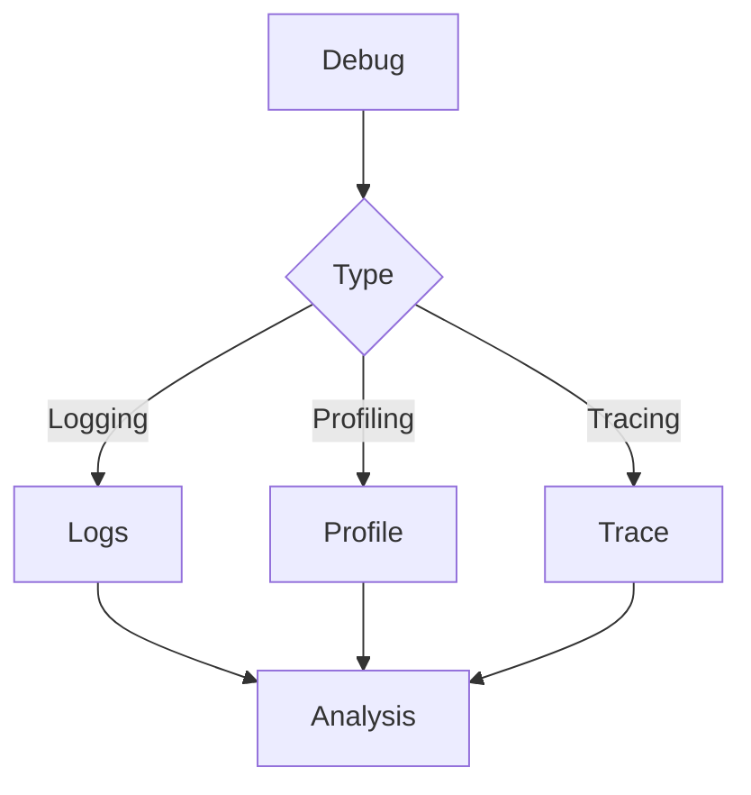
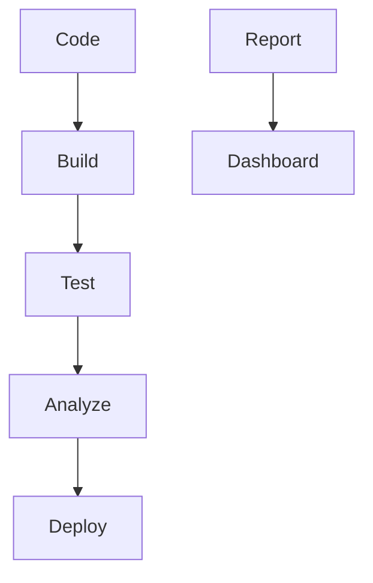

# Development Guide

## Development Environment

### Setup


### Requirements
```yaml
development:
  tools:
    - gcc/g++
    - cmake
    - make
    - git
    - docker
    - gstreamer
  libraries:
    - gstreamer1.0
    - gstreamer1.0-plugins-base
    - gstreamer1.0-plugins-good
    - gstreamer1.0-plugins-bad
    - gstreamer1.0-plugins-ugly
    - libnice
    - libwebrtc
  ide:
    - vscode
    - clion
    - eclipse
```

## Code Structure

### Project Layout


### Implementation
```python
class ProjectStructure:
    def __init__(self):
        self.layout = {
            'src': {
                'components': ['sender', 'receiver', 'signaling'],
                'utils': ['logging', 'config', 'error']
            },
            'include': {
                'headers': ['api', 'types', 'constants']
            },
            'test': {
                'tests': ['unit', 'integration', 'performance']
            }
        }
```

## Build System

### CMake Configuration
```cmake
cmake_minimum_required(VERSION 3.10)
project(webrtc_video)

set(CMAKE_CXX_STANDARD 17)
set(CMAKE_CXX_STANDARD_REQUIRED ON)

find_package(GStreamer REQUIRED)
find_package(WebRTC REQUIRED)

add_executable(sender src/sender.cpp)
target_link_libraries(sender PRIVATE
    GStreamer::gstreamer-1.0
    WebRTC::webrtc
)
```

### Build Process


## Testing

### Test Framework


### Implementation
```python
class TestFramework:
    def __init__(self):
        self.test_cases = []
    
    def add_unit_test(self, test):
        self.test_cases.append({
            'type': 'unit',
            'test': test
        })
    
    def add_integration_test(self, test):
        self.test_cases.append({
            'type': 'integration',
            'test': test
        })
    
    def run_tests(self):
        for test in self.test_cases:
            self.run_test(test)
```

## Version Control

### Git Workflow


### Implementation
```bash
# Feature branch
git checkout -b feature/new-feature

# Development
git add .
git commit -m "Add new feature"

# Testing
git push origin feature/new-feature

# Review
git request-pull origin/master feature/new-feature

# Merge
git checkout master
git merge feature/new-feature
```

## Documentation

### Documentation Structure


### Implementation
```python
class Documentation:
    def __init__(self):
        self.structure = {
            'api': {
                'reference': ['classes', 'functions', 'types']
            },
            'architecture': {
                'design': ['components', 'interfaces', 'dataflow']
            },
            'examples': {
                'code': ['basic', 'advanced', 'custom']
            },
            'guides': {
                'usage': ['setup', 'configuration', 'troubleshooting']
            }
        }
```

## Code Style

### Style Guide
```yaml
style:
  general:
    indent: 4
    line_length: 80
    encoding: utf-8
  naming:
    classes: PascalCase
    functions: camelCase
    variables: snake_case
    constants: UPPER_CASE
  formatting:
    braces: same_line
    spaces: after_operators
    comments: above_code
```

### Implementation
```python
class CodeStyle:
    def __init__(self):
        self.rules = self.load_rules()
    
    def check_style(self, code):
        # Check code against style rules
        pass
    
    def format_code(self, code):
        # Format code according to style rules
        pass
```

## Debugging

### Debug Tools


### Implementation
```python
class Debugging:
    def __init__(self):
        self.logger = logging.getLogger('debug')
    
    def enable_logging(self):
        logging.basicConfig(
            level=logging.DEBUG,
            format='%(asctime)s - %(name)s - %(levelname)s - %(message)s'
        )
    
    def profile_code(self, func):
        @functools.wraps(func)
        def wrapper(*args, **kwargs):
            start = time.time()
            result = func(*args, **kwargs)
            end = time.time()
            self.logger.debug(f'{func.__name__} took {end - start} seconds')
            return result
        return wrapper
```

## Continuous Integration

### CI Pipeline


### Implementation
```yaml
# .gitlab-ci.yml
stages:
  - build
  - test
  - deploy

build:
  stage: build
  script:
    - mkdir build
    - cd build
    - cmake ..
    - make

test:
  stage: test
  script:
    - cd build
    - ctest

deploy:
  stage: deploy
  script:
    - docker build -t webrtc_video .
    - docker push webrtc_video
```

## Best Practices

### Development Practices
1. Code Organization
   - Follow project structure
   - Use consistent naming
   - Document code

2. Testing
   - Write unit tests
   - Perform integration tests
   - Run performance tests

3. Version Control
   - Use feature branches
   - Write meaningful commits
   - Review code changes

### Maintenance
1. Regular Updates
   - Update dependencies
   - Apply security patches
   - Review code quality

2. Documentation
   - Keep docs up to date
   - Add examples
   - Document changes

3. Monitoring
   - Track issues
   - Monitor performance
   - Collect feedback 