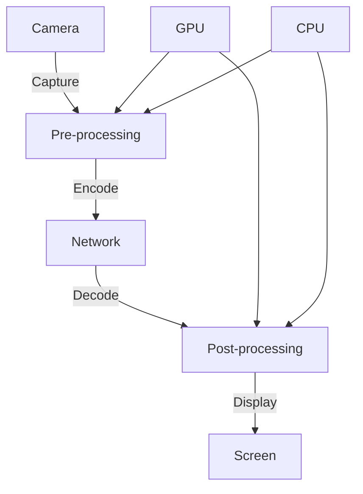
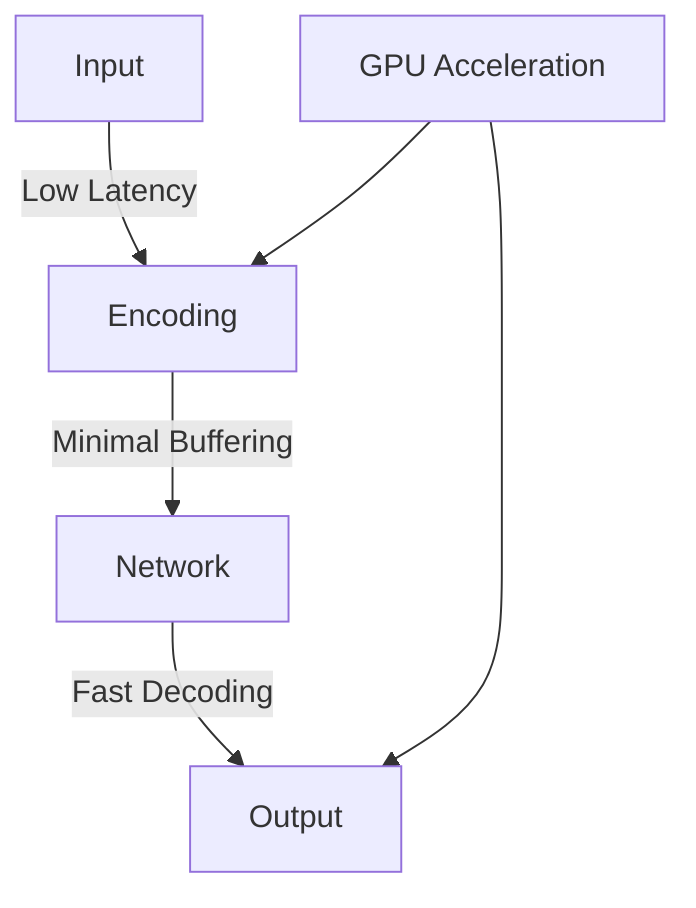
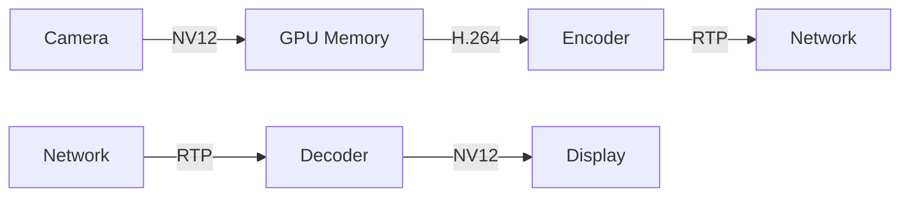
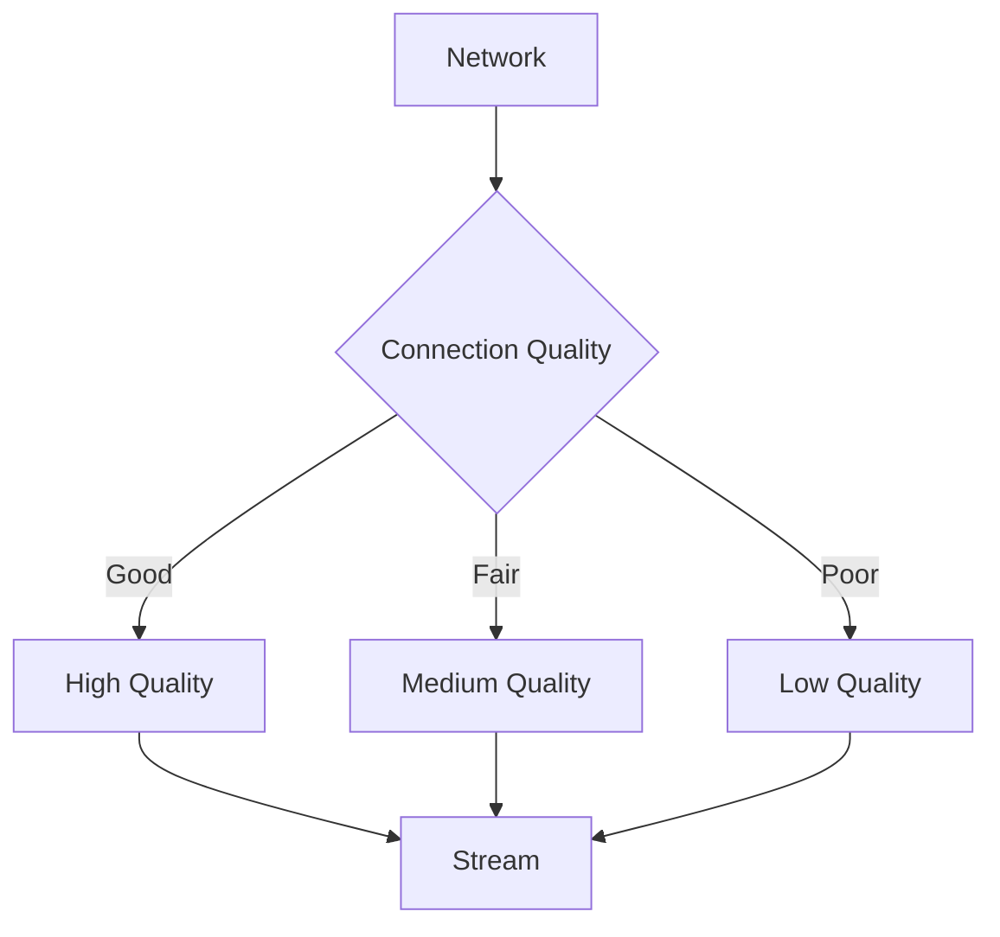
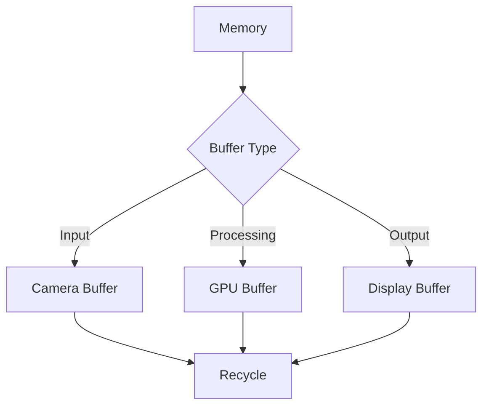
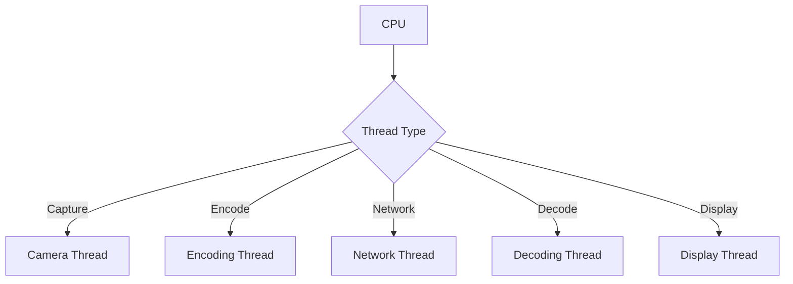
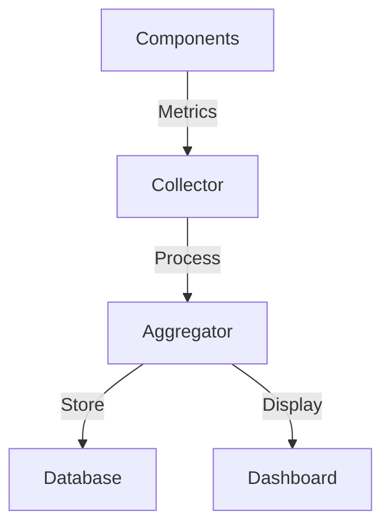

# Performance Optimization Guide

## Performance Architecture



## Latency Optimization

### Pipeline Latency


### Implementation
```python
class LatencyOptimizer:
    def __init__(self):
        self.pipeline = self.create_pipeline()
    
    def create_pipeline(self):
        return Gst.parse_launch(
            "v4l2src ! video/x-raw,format=NV12 ! "
            "nvv4l2h264enc preset=low-latency ! "
            "rtph264pay config-interval=1 ! "
            "webrtcbin latency=100"
        )
    
    def optimize(self):
        self.set_low_latency_mode()
        self.minimize_buffering()
        self.enable_gpu_acceleration()
```

## GPU Optimization

### GPU Pipeline


### Implementation
```python
class GPUOptimizer:
    def __init__(self):
        self.gpu = self.detect_gpu()
    
    def optimize_encoder(self):
        return {
            'preset': 'low-latency',
            'bitrate': 4000000,
            'gop-size': 30,
            'bframes': 0,
            'rc-mode': 'cbr'
        }
    
    def optimize_decoder(self):
        return {
            'low-latency': True,
            'num-output-buffers': 4,
            'drop-frame-interval': 0
        }
```

## Network Optimization

### Bandwidth Management


### Implementation
```python
class NetworkOptimizer:
    def __init__(self):
        self.quality_levels = {
            'high': {'bitrate': 4000000, 'fps': 30},
            'medium': {'bitrate': 2000000, 'fps': 20},
            'low': {'bitrate': 1000000, 'fps': 15}
        }
    
    def adjust_quality(self, network_quality):
        return self.quality_levels[network_quality]
    
    def monitor_network(self):
        # Monitor network conditions
        pass
```

## Memory Optimization

### Buffer Management


### Implementation
```python
class MemoryOptimizer:
    def __init__(self):
        self.buffer_pool = BufferPool()
    
    def optimize_buffers(self):
        return {
            'input_buffers': 4,
            'processing_buffers': 2,
            'output_buffers': 4,
            'recycle_buffers': True
        }
    
    def manage_memory(self):
        # Monitor and adjust memory usage
        pass
```

## CPU Optimization

### Thread Management


### Implementation
```python
class CPUOptimizer:
    def __init__(self):
        self.thread_pool = ThreadPool()
    
    def optimize_threads(self):
        return {
            'camera_threads': 1,
            'encoding_threads': 2,
            'network_threads': 1,
            'decoding_threads': 2,
            'display_threads': 1
        }
    
    def set_affinity(self):
        # Set CPU affinity
        pass
```

## Performance Monitoring

### Metrics Collection


### Implementation
```python
class PerformanceMonitor:
    def __init__(self):
        self.metrics = {}
    
    def collect_metrics(self):
        return {
            'latency': self.measure_latency(),
            'fps': self.measure_fps(),
            'bitrate': self.measure_bitrate(),
            'cpu_usage': self.measure_cpu(),
            'gpu_usage': self.measure_gpu(),
            'memory_usage': self.measure_memory()
        }
    
    def analyze_performance(self):
        # Analyze collected metrics
        pass
```

## Configuration

### Performance Settings
```yaml
performance:
  latency:
    target: 100ms
    max: 200ms
  quality:
    high:
      bitrate: 4000000
      fps: 30
    medium:
      bitrate: 2000000
      fps: 20
    low:
      bitrate: 1000000
      fps: 15
  resources:
    gpu:
      enabled: true
      memory_limit: 512MB
    cpu:
      threads: 4
      affinity: [0,1,2,3]
  buffers:
    input: 4
    processing: 2
    output: 4
```

## Best Practices

### Optimization Techniques
1. Latency Reduction
   - Use low-latency encoder presets
   - Minimize buffer sizes
   - Enable zero-copy where possible

2. Resource Management
   - Monitor GPU memory usage
   - Optimize thread allocation
   - Implement buffer recycling

3. Quality Control
   - Adaptive bitrate streaming
   - Dynamic resolution adjustment
   - Frame rate control

### Monitoring
1. System Metrics
   - CPU usage
   - GPU utilization
   - Memory consumption
   - Network bandwidth

2. Application Metrics
   - Frame rate
   - Encoding time
   - Decoding time
   - End-to-end latency

3. Quality Metrics
   - Video quality
   - Audio quality
   - Synchronization
   - Packet loss 