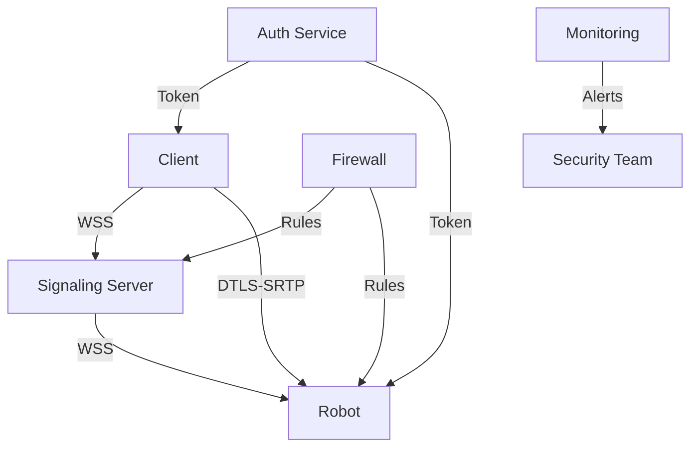
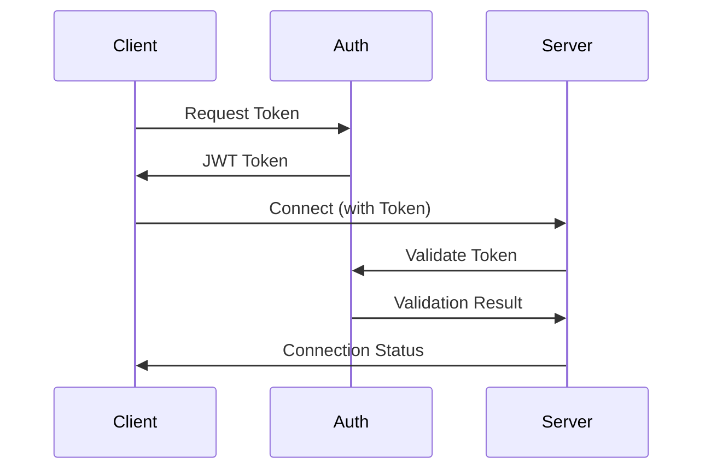
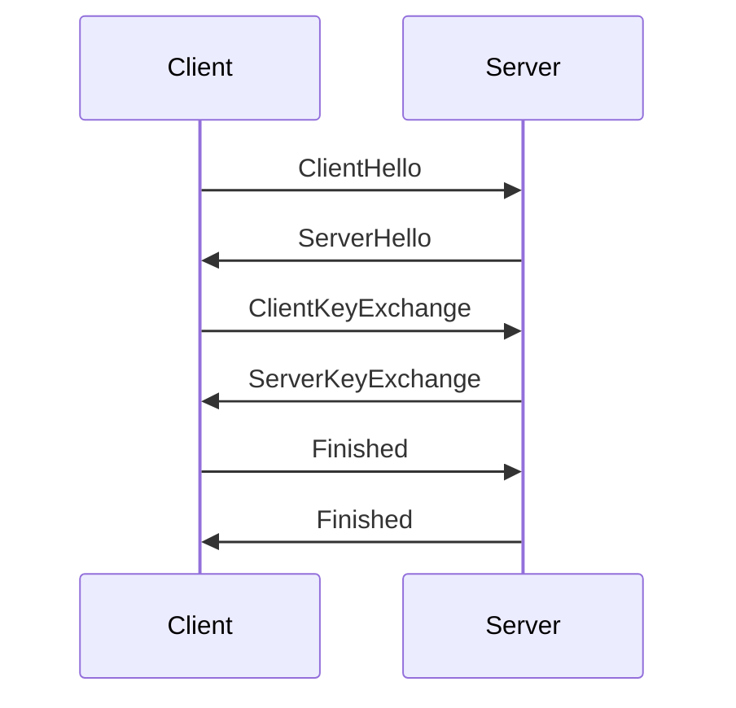
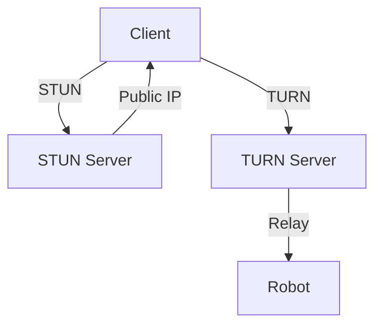
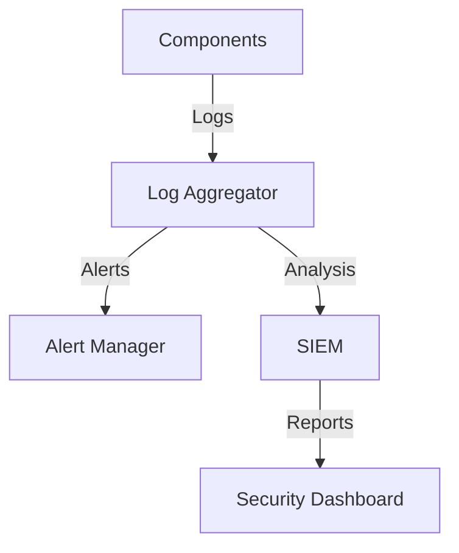
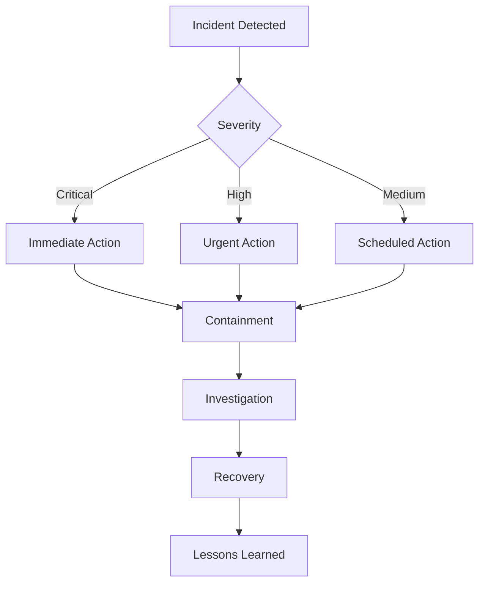
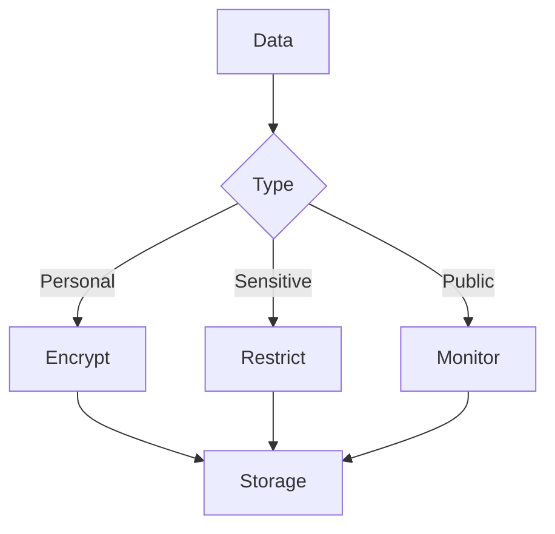
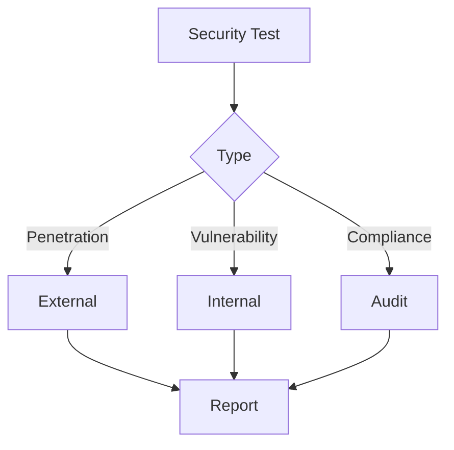

# Security Guide

## Security Architecture



## Authentication

### Token-based Authentication


### Implementation
```python
class Authentication:
    def __init__(self):
        self.secret_key = os.getenv('JWT_SECRET')
        self.algorithm = 'HS256'
    
    def generate_token(self, user_id):
        payload = {
            'user_id': user_id,
            'exp': datetime.utcnow() + timedelta(hours=1)
        }
        return jwt.encode(payload, self.secret_key, algorithm=self.algorithm)
    
    def validate_token(self, token):
        try:
            payload = jwt.decode(token, self.secret_key, algorithms=[self.algorithm])
            return payload['user_id']
        except jwt.ExpiredSignatureError:
            raise AuthenticationError('Token expired')
        except jwt.InvalidTokenError:
            raise AuthenticationError('Invalid token')
```

## Encryption

### DTLS-SRTP Setup


### Certificate Management
```bash
# Generate certificates
openssl req -x509 -newkey rsa:4096 -keyout key.pem -out cert.pem -days 365

# Configure WebSocket server
wss://example.com:8080
```

## Network Security

### Firewall Configuration
```bash
# Allow WebRTC traffic
sudo ufw allow 8080/tcp
sudo ufw allow 8080/udp

# Allow STUN/TURN
sudo ufw allow 3478/udp
sudo ufw allow 5349/tcp
```

### NAT Traversal


## Access Control

### Role-based Access
```yaml
roles:
  admin:
    permissions:
      - camera_control
      - system_config
      - user_management
  operator:
    permissions:
      - camera_view
      - basic_control
  viewer:
    permissions:
      - camera_view
```

### Implementation
```python
class AccessControl:
    def __init__(self):
        self.roles = self.load_roles()
    
    def check_permission(self, user_id, permission):
        role = self.get_user_role(user_id)
        return permission in self.roles[role]['permissions']
    
    def get_user_role(self, user_id):
        # Get role from database
        pass
```

## Monitoring

### Security Monitoring


### Implementation
```python
class SecurityMonitor:
    def __init__(self):
        self.logger = logging.getLogger('security')
    
    def log_event(self, event_type, details):
        self.logger.info({
            'timestamp': datetime.utcnow(),
            'type': event_type,
            'details': details
        })
    
    def check_anomalies(self):
        # Analyze logs for suspicious patterns
        pass
```

## Incident Response

### Response Plan


### Implementation
```python
class IncidentResponse:
    def __init__(self):
        self.team = self.load_response_team()
    
    def handle_incident(self, incident):
        severity = self.assess_severity(incident)
        self.notify_team(severity)
        self.contain_incident(incident)
        self.investigate(incident)
        self.recover(incident)
        self.learn(incident)
```

## Best Practices

### Configuration
```yaml
security:
  authentication:
    enabled: true
    method: jwt
    token_expiry: 3600
  encryption:
    enabled: true
    protocol: dtls-srtp
    certificate: /path/to/cert.pem
  access_control:
    enabled: true
    default_role: viewer
  monitoring:
    enabled: true
    log_level: INFO
    alert_threshold: HIGH
```

### Regular Tasks
1. Certificate Rotation
   - Monthly certificate updates
   - Key rotation
   - Revocation list maintenance

2. Access Review
   - Quarterly role review
   - Permission audit
   - User activity monitoring

3. Security Updates
   - Weekly dependency updates
   - Monthly security patches
   - Quarterly security review

## Compliance

### Data Protection


### Implementation
```python
class DataProtection:
    def __init__(self):
        self.encryption = Encryption()
    
    def protect_data(self, data, classification):
        if classification == 'personal':
            return self.encryption.encrypt(data)
        elif classification == 'sensitive':
            return self.restrict_access(data)
        else:
            return self.monitor_access(data)
```

## Security Testing

### Test Plan


### Implementation
```python
class SecurityTesting:
    def __init__(self):
        self.tools = self.load_testing_tools()
    
    def run_tests(self):
        self.penetration_test()
        self.vulnerability_scan()
        self.compliance_check()
    
    def generate_report(self):
        # Create security assessment report
        pass
``` 