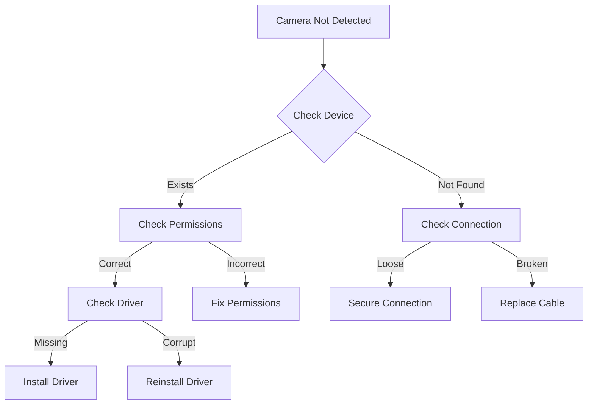
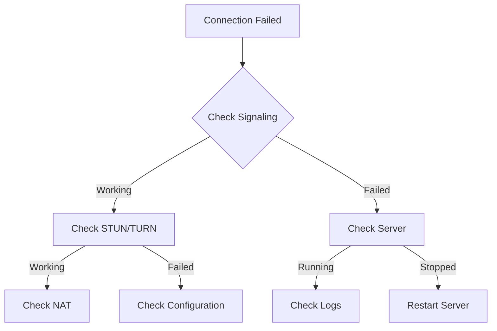
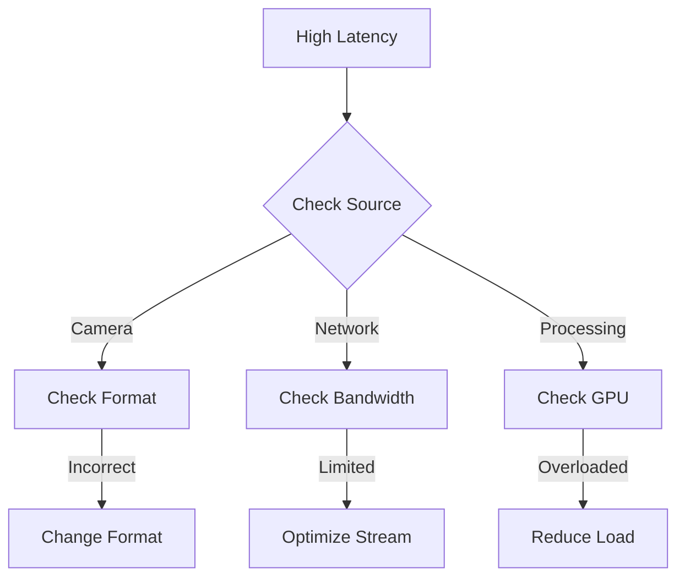
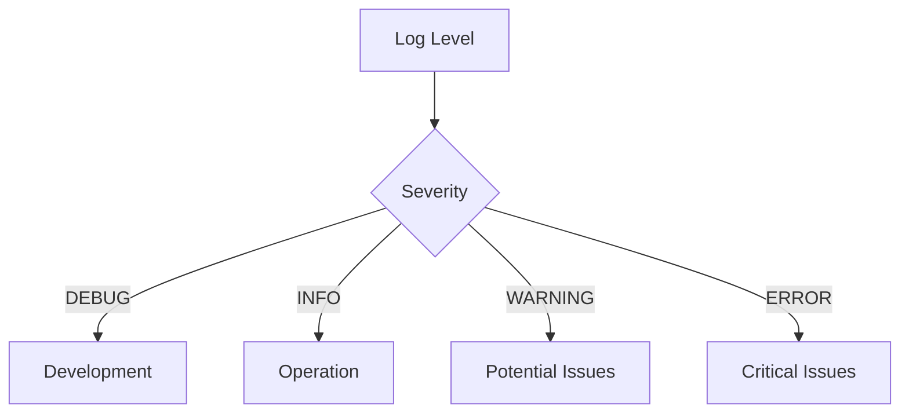
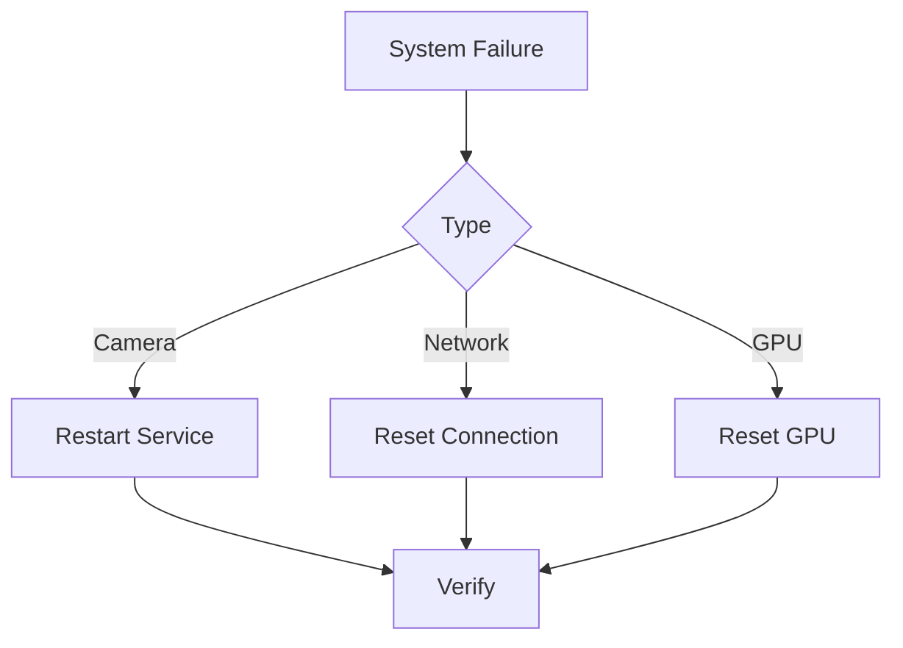

# Troubleshooting Guide

## Common Issues

### Camera Issues

#### Camera Not Detected


#### Troubleshooting Steps
1. Check device presence:
   ```bash
   ls /dev/video*
   v4l2-ctl --list-devices
   ```

2. Verify permissions:
   ```bash
   ls -l /dev/video0
   groups
   sudo usermod -a -G video $USER
   ```

3. Test camera:
   ```bash
   gst-launch-1.0 v4l2src ! videoconvert ! autovideosink
   ```

4. Check driver:
   ```bash
   dmesg | grep video
   modinfo uvcvideo
   ```

### WebRTC Connection Issues

#### Connection Diagram


#### Troubleshooting Steps
1. Verify signaling server:
   ```bash
   curl http://localhost:8080/health
   netstat -tulpn | grep 8080
   ```

2. Check STUN/TURN:
   ```bash
   curl -X GET http://localhost:8080/stun
   turnutils_uclient -v -u user -w pass turn:turn.example.com:3478
   ```

3. Test NAT traversal:
   ```bash
   stunclient stun.l.google.com:19302
   ```

4. Check firewall:
   ```bash
   sudo ufw status
   sudo iptables -L
   ```

### Performance Issues

#### Latency Analysis


#### Troubleshooting Steps
1. Measure latency:
   ```bash
   gst-launch-1.0 v4l2src ! videoconvert ! timeoverlay ! autovideosink
   ```

2. Check GPU usage:
   ```bash
   nvidia-smi
   nvidia-smi dmon
   ```

3. Monitor network:
   ```bash
   iftop -i eth0
   netstat -s | grep -i retransmit
   ```

4. Profile pipeline:
   ```bash
   GST_DEBUG=3 gst-launch-1.0 ...
   ```

### Error Messages

#### Common Errors
1. Camera Errors:
   ```
   ERROR: Could not open device '/dev/video0'
   ERROR: Device is busy
   ERROR: Invalid format
   ```

2. WebRTC Errors:
   ```
   ERROR: ICE connection failed
   ERROR: Failed to create offer
   ERROR: Signaling connection failed
   ```

3. GStreamer Errors:
   ```
   ERROR: Pipeline doesn't want to preroll
   ERROR: Could not link elements
   ERROR: Internal data stream error
   ```

#### Error Resolution
1. Camera Errors:
   - Check device permissions
   - Verify camera is not in use
   - Confirm supported formats

2. WebRTC Errors:
   - Check network connectivity
   - Verify STUN/TURN servers
   - Confirm signaling server

3. GStreamer Errors:
   - Check element compatibility
   - Verify pipeline syntax
   - Confirm plugin installation

### Log Analysis

#### Log Levels


#### Log Collection
```bash
# Enable debug logging
export GST_DEBUG=3
export WEBRTC_DEBUG=1

# Collect logs
journalctl -u webrtc-service
tail -f /var/log/webrtc.log
```

### System Checks

#### Hardware Verification
```bash
# Check GPU
nvidia-smi
lspci | grep -i nvidia

# Check Camera
v4l2-ctl --list-devices
v4l2-ctl --list-formats

# Check Network
ifconfig
ping -c 4 8.8.8.8
```

#### Software Verification
```bash
# Check GStreamer
gst-inspect-1.0
gst-inspect-1.0 nvv4l2h264enc

# Check WebRTC
gst-inspect-1.0 webrtcbin

# Check Dependencies
dpkg -l | grep gstreamer
dpkg -l | grep webrtc
```

### Recovery Procedures

#### System Recovery


#### Recovery Steps
1. Service Restart:
   ```bash
   sudo systemctl restart webrtc-service
   ```

2. Network Reset:
   ```bash
   sudo ifdown eth0 && sudo ifup eth0
   ```

3. GPU Reset:
   ```bash
   sudo nvidia-smi --gpu-reset
   ```

### Prevention

#### Best Practices
1. Regular Monitoring
   - System metrics
   - Network performance
   - GPU utilization

2. Maintenance
   - Regular updates
   - Log rotation
   - Backup configuration

3. Configuration
   - Document settings
   - Version control
   - Test changes

#### Monitoring Setup
```yaml
monitoring:
  system:
    - cpu_usage
    - memory_usage
    - gpu_usage
  network:
    - bandwidth
    - latency
    - packet_loss
  application:
    - frame_rate
    - encoding_time
    - decoding_time
``` 