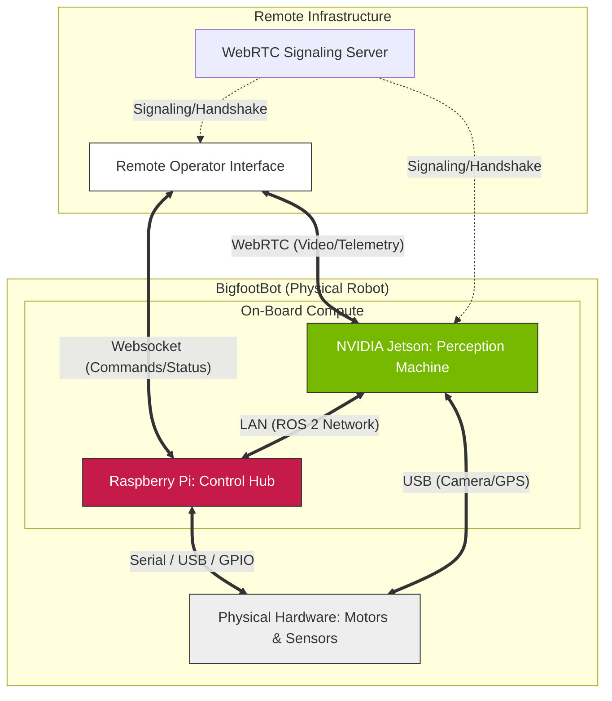

# System Architecture

The BigfootBot is a modular, ROS 2-based autonomous robot designed to work on a distributed compute stack (NVIDIA Jetson, Raspberry Pi, Arduino).

---

## 1. System Context Diagram (Level 1)

This high-level view shows how the robot interacts with the remote operator and the physical world. It omits internal ROS 2 details to focus on the overall system boundaries.

---

## 2. Technical Context & Drill-Down

To understand the internal logic, communication, and deployment of the system, please refer to the following documents:

| Level | Document | Audience | Purpose |
| :--- | :--- | :--- | :--- |
| **System** | [**README.md**](./README.md) | Anyone | High-level system context and boundaries. |
| **Logical** | [**Node Graph (Logical View)**](./node_graph.md#1-logical-view-ros-2-node-graph) | ROS Developers | Detailed ROS 2 topics, services, and node-to-node communication. |
| **Physical** | [**Deployment Map (Physical View)**](./node_graph.md#2-physical-view-deployment-map) | DevOps / Hardware | Container-to-machine mapping and networking. |
| **Subsystem** | [**Control System Architecture**](./control/README.md) | Control Engineers | Functional logic for velocity arbitration and safety. |

---

## Directory Structure Overview
- **`/src`**: Individual ROS 2 packages for perception, control, and interfaces.
- **`/docs`**: High-level architectural, decision, and infrastructure documentation.
- **`/docker`**: Containerization stacks (Jetson and Raspberry Pi specific).
- **`/webrtc-browser`**: Modern TypeScript/React-based remote operator dashboard.
