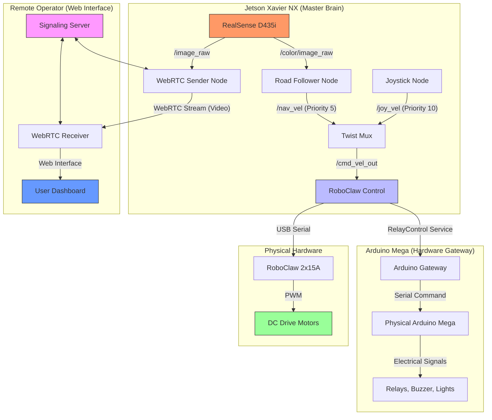

# System Architecture

The BigfootBot is a modular, ROS 2-based autonomous robot designed to work on a distributed compute stack (Jetson, Raspberry Pi, Arduino).

## High-Level System Diagram

The following Mermaid diagram shows how data flows between the major components of the robot across different physical devices.

## Directory Structure Overview
- **`/src`**: Individual ROS 2 packages for perception, control, and interfaces.
- **`/docs`**: High-level architectural, decision, and infrastructure documentation.
- **`/docker`**: Containerization stacks (Master, Teleop, Web, Navigation).
- **`/webrtc-browser`**: Modern TypeScript/React-based remote operator dashboard.

## Technical Context
For more specific details, refer to:
- [**Logical Node Graph**](./node_graph.md)
- [**Control System Architecture**](./control/README.md)
- [**Infrastructure & Networking**](../infra/README.md)
- [**Package: motor_control**](../../src/motor_control/README.md)
