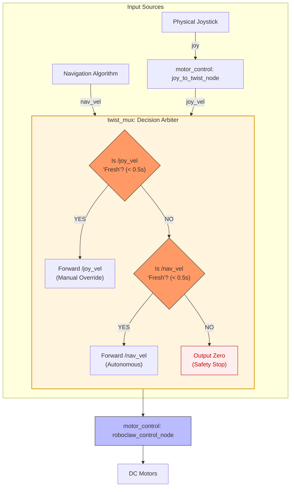

# Control System Architecture

This document describes the high-level logic and functional components of the BigfootBot's control stack, focusing on how different inputs are prioritized and executed safely.

## System Architecture & Deployment

The control system follows a modular architecture where multiple input sources (Manual and Autonomous) are prioritized by a multiplexer before being executed by the motor controller.

For a detailed mapping of all ROS 2 nodes, communication topics, and their physical deployment across the hardware, please refer to the primary architecture document:

*   [**Logical View (Node Graph)**](../node_graph.md#1-logical-view-ros-2-node-graph) - To see topic and service communication.
*   [**Physical View (Deployment Map)**](../node_graph.md#2-physical-view-deployment-map) - To see container deployment on the Raspberry Pi and Jetson.

---

## Velocity Arbitration Logic (The "Heartbeat" Check)

The `twist_mux` node acts as the decision arbiter. It uses a **freshness-based priority system** where every input topic must provide a "heartbeat" message at least every 0.5 seconds to remain active.

---

## Core Components

### 1. Manual Control Logic (`joy_to_twist_node`)
This node (implemented in `src/motor_control/motor_control/joy_to_twist.py`) is responsible for translating raw physical inputs into safe ROS 2 commands:
*   **Dynamic Steering**: The node calculates a `dynamic_angular_scale` based on linear speed. As the robot moves faster, steering sensitivity is automatically reduced to prevent high-speed instability.
*   **Trim Correction**: Real-time mechanical drift correction via joystick buttons (adjusts `trim_value` to keep the robot driving straight).
*   **Hardware Bridge**: Translates joystick buttons into command strings for the `bfb_arduino_gateway` (Buzzer, Headlights, Beacon).

### 2. Autonomous Navigation
Vision-based road following (from the `bfb_road_follower` package) or other Nav2-based stacks publish velocity commands to the `/nav_vel` topic.

### 3. Arbitration (`twist_mux`)
Ensures safety by prioritizing manual overrides. If a signal is received on `/joy_vel`, it will override autonomous commands for the duration of the 0.5s timeout. If no messages are received on any topic, it outputs a zero-velocity command to ensure the robot stops safely.

### 4. Execution (`motor_control`)
The `roboclaw_control_node` is the final software stage. It performs differential drive kinematics to convert linear and angular velocity into motor-specific commands for the physical RoboClaw driver.

## Safety Features
*   **Heartbeat Timeout**: If the software or network lags for more than 0.5s, the system automatically stops the robot.
*   **Overcurrent Protection**: The `roboclaw_control_node` monitors motor current and will automatically stop if it exceeds 30A.
*   **Battery Monitoring**: Real-time voltage monitoring ensures the robot stops before the Li-ion battery reaches a critical discharge level.
