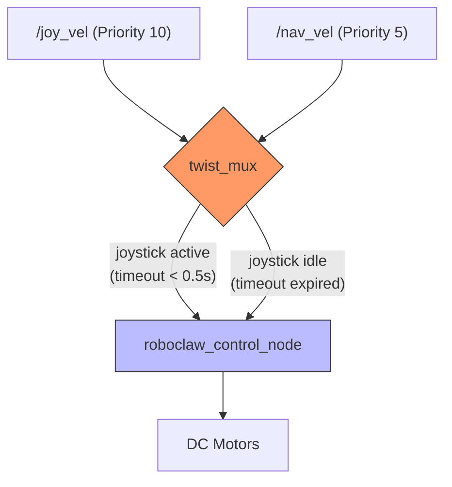

# Control System Architecture

This document describes the high-level logic and functional components of the BigfootBot's control stack.

## System Architecture & Deployment

The control system follows a modular architecture where multiple input sources (Manual and Autonomous) are prioritized by a multiplexer before being executed by the motor controller.

For a detailed mapping of all ROS 2 nodes, communication topics, and their physical deployment across the hardware, please refer to the primary architecture document:

*   [**Logical View (Node Graph)**](../node_graph.md#1-logical-view-ros-2-node-graph) - To see topic and service communication.
*   [**Physical View (Deployment Map)**](../node_graph.md#2-physical-view-deployment-map) - To see container deployment on the Raspberry Pi and Jetson.

## Velocity Arbitration Logic

The following diagram explains how different velocity sources are prioritized by the `twist_mux` node to ensure safe operation.

---

## Core Components

### 1. Input Sources
*   **Manual Control**: A joystick (PS3 or Logitech) is processed by the `joy_to_twist_node`, publishing to the high-priority `/joy_vel` topic.
*   **Autonomous Navigation**: Vision-based road following or Nav2 stacks publish to the lower-priority `/nav_vel` topic.

### 2. Multiplexer (`twist_mux`)
The `twist_mux` node ensures safety by prioritizing manual overrides. If a message is received on `/joy_vel`, it will override any autonomous commands on `/nav_vel` for the duration of the timeout (0.5s).

### 3. Execution (`motor_control`)
The `roboclaw_control_node` is the final stage of the software stack. It performs differential drive kinematics to convert linear and angular velocity into motor-specific duty cycles.

## Safety Features
*   **Joystick Deadman Switch**: The `joy_to_twist_node` requires a specific "enable" axis to be held.
*   **Overcurrent Protection**: The `roboclaw_control_node` monitors motor current and will automatically stop the robot if it exceeds 30A.
*   **Battery Monitoring**: Real-time voltage monitoring ensures the robot stops before the Li-ion battery is damaged.
