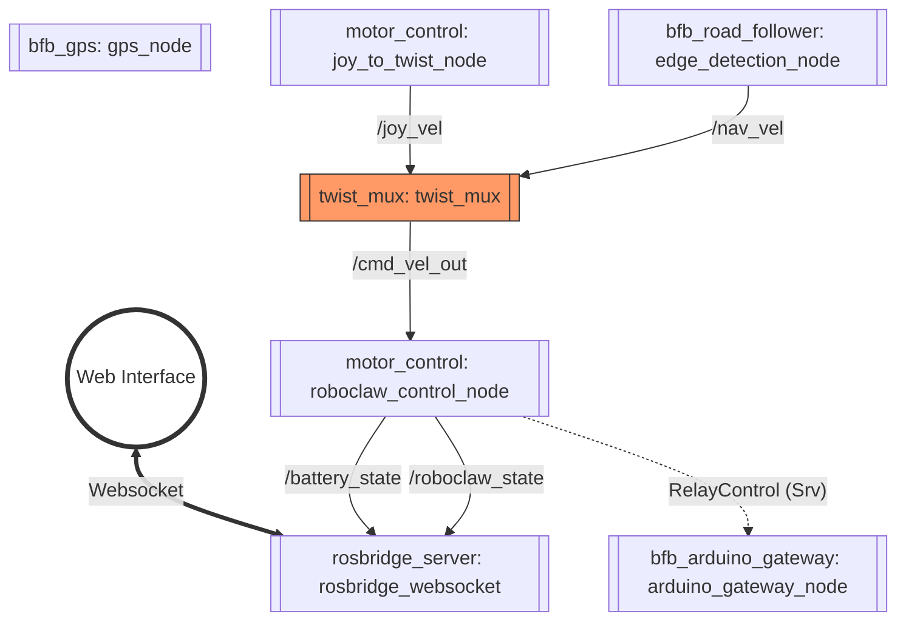
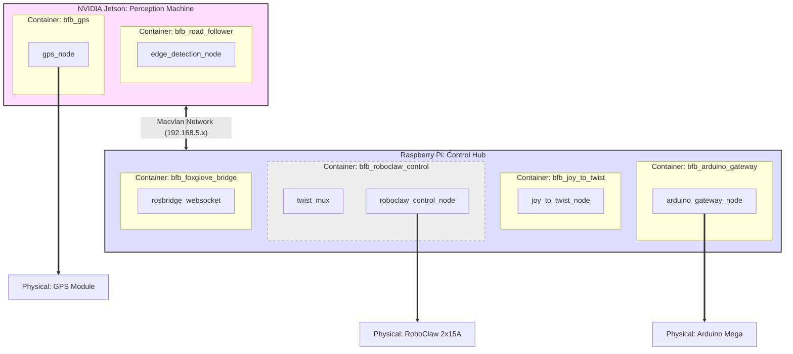

# System Architecture: Logical & Physical Views

To understand the BigfootBot, we separate the architecture into two layers: the **Logical View** (how data flows between ROS nodes) and the **Physical View** (how those nodes are deployed across hardware and containers).

---

## 1. Logical View (ROS 2 Node Graph)

This view focuses purely on the software logic and data communication. It is independent of which machine or container the code runs on.

---

## 2. Physical View (Deployment Map)

This view describes the infrastructure: how the software is packaged into Docker containers and distributed across the physical hardware (NVIDIA Jetson and Raspberry Pi).

---

## Node & Package Descriptions

### NVIDIA Jetson Stack
| Node | Package | Purpose |
| :--- | :--- | :--- |
| `gps_node` | `bfb_gps` | Interfaces with the physical GPS module to provide location data. |
| `edge_detection_node` | `bfb_road_follower` | Processes camera images to detect road boundaries and output autonomous velocity. |

### Raspberry Pi Stack
| Node | Package | Purpose |
| :--- | :--- | :--- |
| `twist_mux` | `twist_mux` | Multiplexes multiple velocity inputs based on priority (Manual > Auto). |
| `roboclaw_control_node` | `motor_control` | Kinematics engine; converts Twist to motor commands and monitors hardware health. |
| `joy_to_twist_node` | `motor_control` | Translates raw physical joystick (Joy) inputs into manual velocity commands. |
| `arduino_gateway_node` | `bfb_arduino_gateway` | Serial bridge for controlling auxiliary hardware (lights, buzzer, relays). |
| `rosbridge_websocket` | `rosbridge_server` | JSON-based bridge allowing the web dashboard to communicate with ROS 2. |

---

## Key Architectural Insights

1.  **Co-location for Safety**: The `twist_mux` and `roboclaw_control_node` share the same container (`C_RC`) on the Raspberry Pi. This ensures that the final decision-making and motor execution happen on the same physical hardware that is connected to the RoboClaw.
2.  **Resource Optimization**: Compute-intensive vision tasks (`N_RF`) are isolated on the NVIDIA Jetson to utilize its GPU, while time-critical I/O and manual control are handled by the Raspberry Pi.
3.  **Network Transparency**: Thanks to the **Macvlan network**, ROS 2 nodes on the Jetson can communicate with nodes on the RPi as if they were on a single machine, despite being physically separate.
